***
# Project Overview
## Church Barn
***

Church Barn is a lovingly converted barn, and holiday let in the sleepy village of Perranuthnoe, Southwest Cornwall. It is a place close to my heart, especially during the last year of lockdown, where we all learnt not to take our freedom to travel for granted.

To date, Church Barn has been listed on a holiday letting marketplace, who list the property amongst other competing properties in the area, they have full control/ownership of the brand, provide online booking, and charge high fees/commission.

## Vision:
Now the owner would like an additional platform to take back control of his business in marketing/selling the property direct to consumers, create more bookings, and manage the bookings himself.

## Objectives:
The goal is to build an intuitive and responsive website, achieving the following stakeholder requirements:

### Short term:
* CTA, invoke a positive reaction from the user to book directly with owner via website enquiry form. Increasing D2C sales will reduce agency fees/commission and increase margins/profitability.
* Showcase/brand Church Barn as an inclusive holiday destination to a wide audience of all demographics.

### Long term:
* Increase online presence and potentially eliminate the need for external 3rd party letting marketplace in the long term/future, managing all bookings, eliminating all agency fees/commission, increase profitability and take full control of Church Barn brand. 

## Responsive site
Using the website <a href="http://ami.responsivedesign.is/">Am I Responsive</a>, I used the image that you see below displaying my websites home page across mobile, tablet and desktop.

## User Experience

### User Stories:
* As a user, who occasionally abandons my purchases due to bad product information, I want a website that is easy to navigate, so I can access all the key information, such as property specification, for my holiday without any challenges or flaws.
* As a user, who can sometimes be impatient, and limited for time, my path to purchase needs to be flawless, I need to know how to enquire/book holiday instantly.
* As a user of any demographic, I need to feel well informed/assured of the property’s suitability quickly and efficiently.
* As a user I need assurance/security that I am booking a property of high standards/quality from a trustworthy/legitimate source.
* As a user who has never visited Church Barn or the surrounding area, I want a 360 overview of the attractions, beaches, places to eat and activities .
* As a user who has never visited Church Barn, I want relevant imagery to visualise/anticipate my holiday, creating the desire to book and look forward to my holiday.
* As a user of multiple devices, I need a website that is fully responsive, invoking the same user experience across all devices, in particular my mobile. 

# Visual Design

## 1. Colour Palette: 

A coastal palette has been chosen to correlate and appear aesthetically pleasing against the coastal/property imagery. The relevance of the coastal colour palette will appeal to all demographics and users and invoke positive first impressions/associations/emotions. 

## 2. Typography

The following font Roboto have been selected to ensure the text is easy to read, add value to the text, and invoke user to perceive a positive emotion from the text. The fonts chosen are generic and therefore should appeal to any demographic/user. It is rated as Google best font.I choose font lato to compliment some of the heading.

## 3. Wireframe

I used <a href="https://balsamiq.com/">Balsamiq</a> to create rough wireframes for my project in order to plan out the layout of the webpage on both desktop and mobile devices.

* Wireframes for Home Page. 

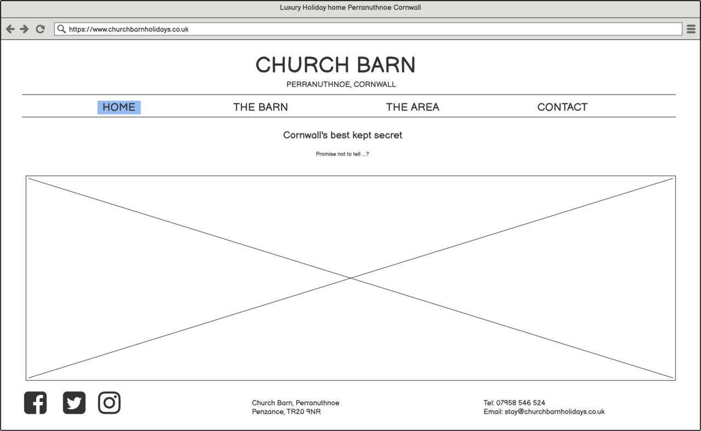

* Wireframes for The Barn Page. 

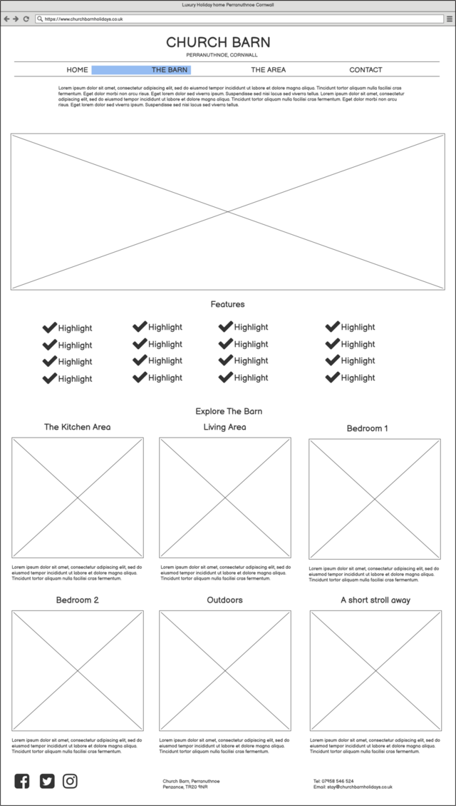

 

* Wireframes for The Area Page. 

* Wireframes for Contact Page. 

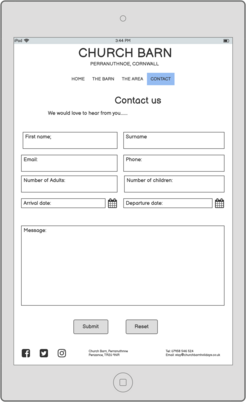

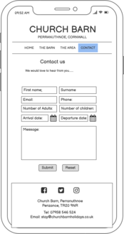

## Features:

*1. Live calendar for bookings
*2. Testimonials
*3. Map 
*4. Professional imagery 
*5. Terms and conditions
*6. More details about area/property
*7. Pricing information

# Existing Features (short term objectives):
## Main Structure -Header, navigation bar and footer
Featured on all four pages. 
* Value: Consistency/aesthetically pleasing

## The Header 
At the top centre of the page. This section will let the user know the site they are visiting and the location. 
* Value: Informs user they the Church Barn website.
See below the view on all devices :

## Navigation bar

* The navbar section is fully responsive. It includes links to home page, the barn, the area, and contact page and is identical on each page to allow for easy navigation.
* All elements and interactive features are consistent, both in colouring and theming.
* Header and navbar text reduce on mobile devices to ensure it fits on the screen.
* Feedback – when the cursor hovers over a link, the link will highlight show a border-top line in an color-line (var).
* Visited and unvisited links will be the same text colour (var) to ensure consistency throughout.
* Clickable links will highlight in the active colour(var) 
* Active page, the link colour will be in bold.

* Value: The navbar will allow user to easily navigate from page to page, across all devices, eliminating need to use a ‘back button’.
See below the view on all devices :

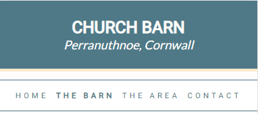

## The Footer 
* The footer is at the bottom of the page, consistent with industry standard.
* On desktops and tablets – the footer will be in three sections with social media links on the left, address in the centre and contact details on the right.
* On mobile devices they will the social media links/address/contact details stack on top of each other.
* Social media links will open in a separate page.
* The email address when clicked will open the email browser
* Feedback – When the cursor hovers over social media symbols, the symbols will highlight in the hover colour(var).
* Clickable social media links will highlight in the active colour(var) and increase in size

See below the difference between desktop and mobile view:

* Value: It is crucial to display contact details on footer section for optimized UX and is industry standard. UX across multiple devices will be consistent.

## Features unique to home page. 
* Main page will have a large ‘hero’ image to invoke a positive emotional response.
* The call to action (CTA) will be prominent to invoke users to book/enquire.

* Value: This section introduces the user to Church Barn, enticing them to learn more and book/enquire.

See below the difference between desktop and mobile view:

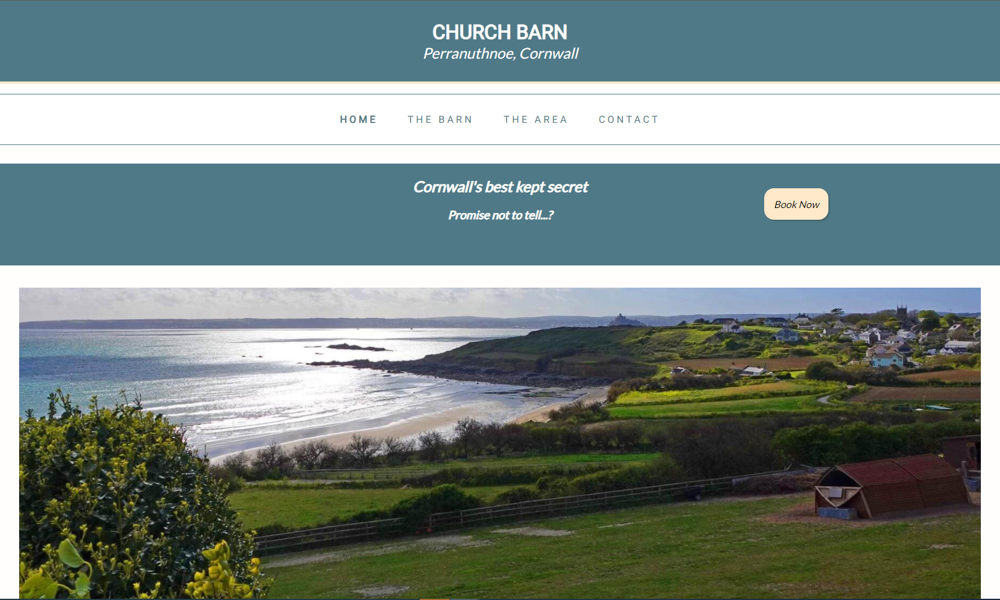

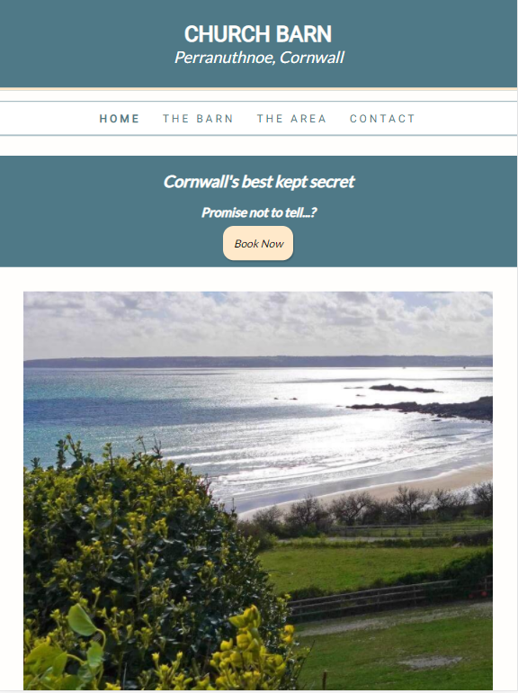

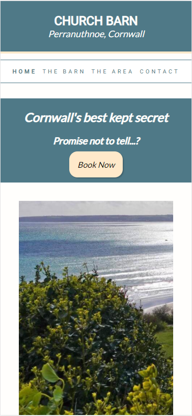

## Features unique to ‘The Barn’ Page
* Description of the property
* ‘Hero’ Image

See below the difference between desktop and mobile view:

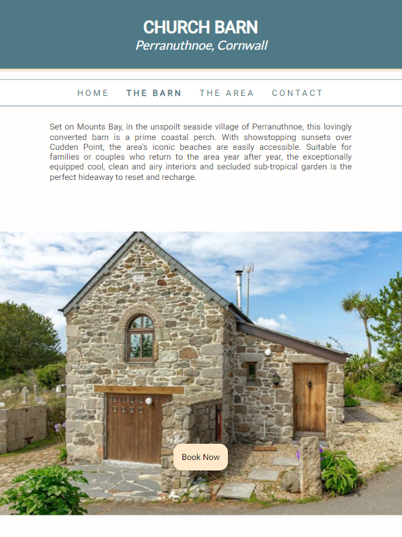

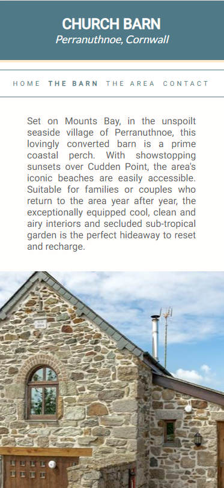

* Barn Feature List of key features with CTA

See below the difference between desktop and mobile view:

* Six Images and description of the property – kitchen area, living area, bedroom1, bedroom2, outdoors and a ‘short stroll away…’.

See below the difference between desktop, tablet and mobile view:

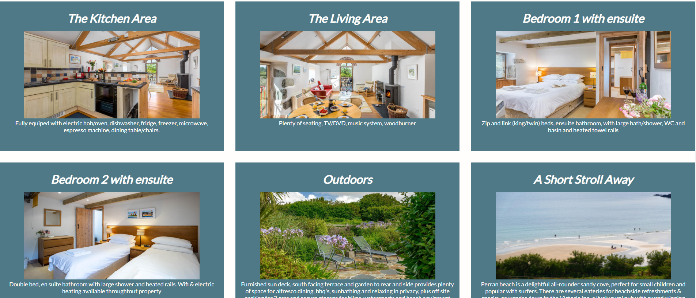

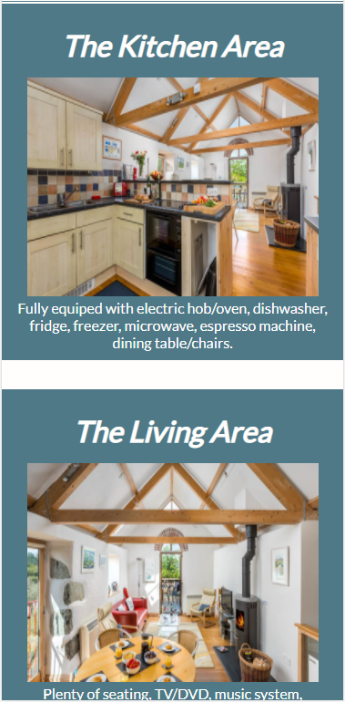

* Value: This section informs the user of the property specification, key information, relevant imagery, with CTA, and consistent UX on all devices.

## Features unique to ‘The Area’ Page 
* Overview/introduction to the area
* Video, introducing South West Cornwall -user initiates controls such as sound/play and will be fully responsive on all devices (80% width and height) 

See below the difference between desktop, tablet and mobile view:

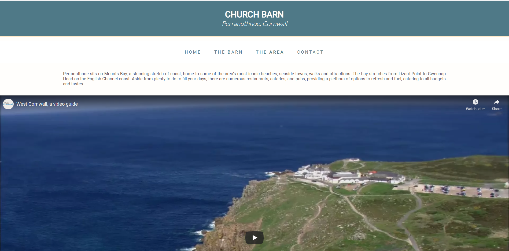

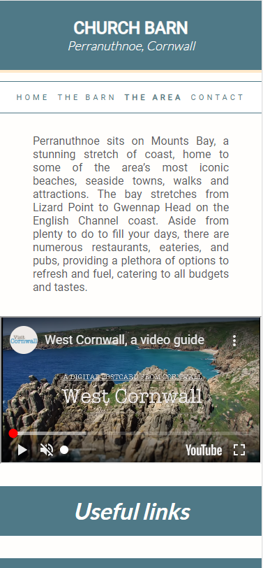

* Four headings (Attractions, Food, Beaches and Activities) with a ‘icon’ images and clickable links relating to the subject with CTA

See below the difference between desktop, tablet and mobile view:

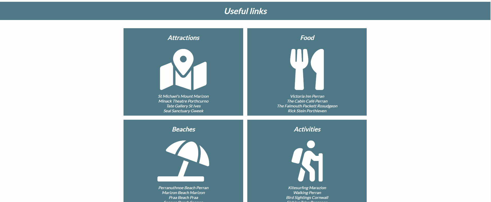

* Value: This section provides user with an overview of local area, beaches, places to eat/drink, and things to do with relevant imagery, invoking response to enquire/book with CTA. UX is consistent across all devices.

## Features unique to Contact us page.

* A contact form with 9 data field inputs, ‘first name’, ‘surname’, ‘email address’, ‘telephone number’,’ number of adults’, ‘number of children’, ‘arrival date’, ‘departure date’, ‘message’ and a submit button and reset button underneath.
* The contact form is responsive on mobile devices and reduces in height and width as well as the buttons.
* Feedback - When the cursor hovers over ‘submit’ /’reset’ the links will highlight in the hover colour(var)
* When clicking on ‘submit’ /’reset’ links, they will highlight in the active colour(var) and repositions button down by 4px

See below the difference between desktop, tablet and mobile view:

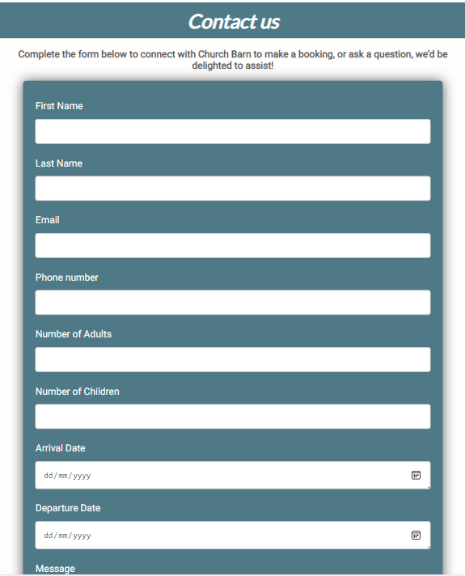

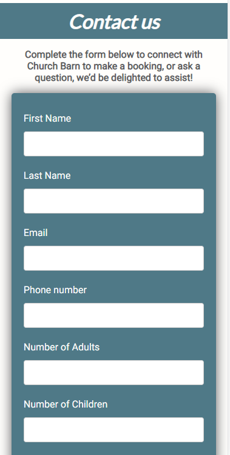

* Value: This section will allow the user complete CTA by submitting an enquiry/booking to owner, providing the owner with all the information initially required to connect with user. UX will be consistent on all devices. 

## Features remaining to implement (long term objectives):
* 1. Live calendar for bookings
* 2. Testimonials
* 3. Map 
* 4. Gallery with professional imagery 
* 5. Terms and conditions
* 6. More details about area/property
* 7. Pricing information

### HTML and CSS Validator Tests
1. W3C HTML Validator
- I opened [W3C HTML Validator](https://validator.w3.org/) and selected the "Validate by URI" option for each page index.html, thebarn.html, thearea.html and contactus.html separately.
- Pages initally came up with the following errors:

index.html

1. changed section to div
2. removed extra </i> from pages
Nothing outstanding

The Barn.html

errors stil outstanding

The Area.html

Point 5 Removed extra <main> , point 6 and 8,9 disappeared
Point 7 removed 

Point 2 removed muted and frameborder=0

Outstanding Point 1 and 4

Contactus.html

Point 1 and 2 changed input from phone to tel
Point 3 and 4 changed input to text and added mm/dd/yyyy
Point 5 moved /div to 	within the header
Point moved /form one up so its within the last div

no errors outstanding

## W3 CSS Validator
- I opened [W3C CSS Validator](https://jigsaw.w3.org/css-validator/)  and selected the "Validate by direct input" option and pasted in the code.
- Pages initally came up with the following errors:

1. i removed the space between "2.25" and "rem"
2. i change the grid-template-areas to grid-areas

- I received the message "Congratulations! No Error Found." 

***